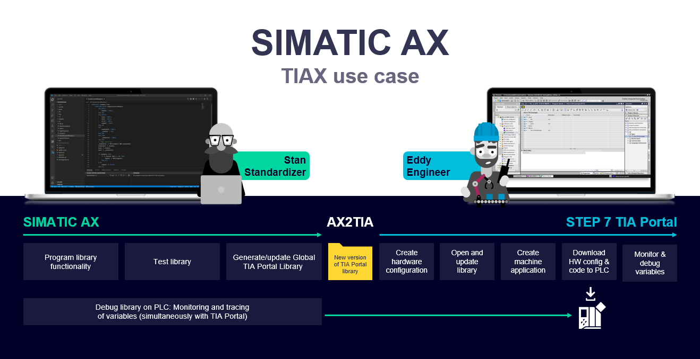

# AX standardizer tutorial TIAX usecase

In this standardizer tutorial, you'll learn about all the important tools necessary to develop a ST library with SIMATIC AX and export it to TIA Portal.
The main goal of this tutorial is to get familiar with the TIAX workflow and basics of the AX IDE.

After this tutorial, you will:

- know how to navigate the basic functions of the AX IDE
- know the basics about Apax
- know how to use the AxUnit testing framework
- be able to write basic functions
- be able to write simple test cases
- be able to implement the TIAX workflow

This tutorial is structured in multiple sequential chapters.

Although this tutorial focuses on the local IDE, the workflows are very similar in the cloud IDE.

## Training chapters

- [1. Setting up a project and Apax package manager usage](./doc/1-setup.md)
- [2. Usage of the testing framework](./doc/2-testing-framework.md)
- [3. Creating the TIA portal Library](./doc/3-exportToTia.md)
- [4. Expanding the library functionality](./doc/4-programmingOwn.md)

### Bonus chapters

- [Introduction to OOP](./doc/oop-introduction.md)
- [Study the AX Community Github](https://github.com/simatic-ax)

## Prerequisites

During the OEM workshop the following prerequisites are allready fulfilled.

- an AX account
- an installation to the offline AX IDE
- a github account

## Additional information

- [The AX website](https://axcite.me) (login required)
- [The AX Community Github](https://github.com/simatic-ax)
- [The SIOS overview page](https://support.industry.siemens.com/cs/document/109815017)

## Contribution

Thanks for your interest in contributing. Anybody is free to report bugs, unclear documentation, and other problems regarding this repository in the Issues section or, even better, propose any changes to this repository using Pull Requests.

## License and Legal information

Please read the [Legal information](LICENSE.md)
