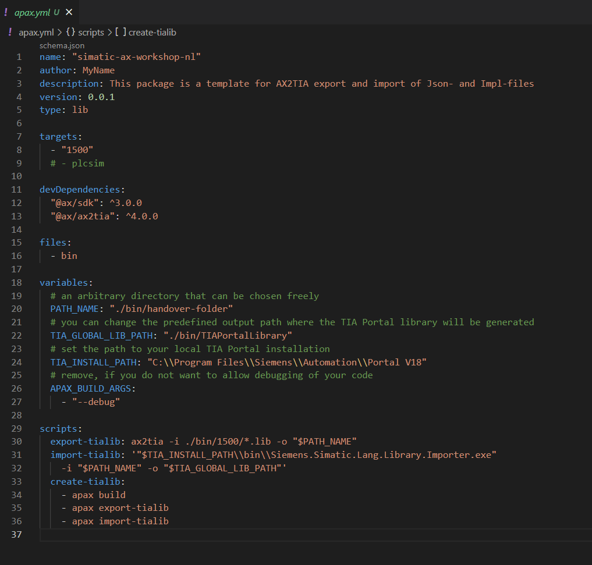

# Setup your TIAX project

## Goal for this training chapter

After this training chapter, you will:

- be able to create workspaces using the clone link from git
- have a rough overview about `apax.yml`
- learn how to install and update dependencies using the Apax extension
- know the difference between `devDependencies` and `dependencies`

### Cloning the workspace with the clone link (hands-on)

1. Copy the clone link to your clipboard:

   ```iec-st
   git@github.com:wspgnl/SIMATIC-AX-Workshop-NL.git
   ```
2. Open the AX code IDE from either your desktop or the windows start menu.
3. You should start with a fresh window, if a old project is opened please start a fresh window by using **File > New window**
4. Click the **Clone repository button** (1) the command palet should open, paste the copied git URL into the command palet (2) and press enter. AX will now copy the files from the repository. AX will ask to open the new folder, choose open. It might ask if the workspace can be trusted, please select yes.

   

### Introducing apax.yml (information)

If you are already familiar with `Apax` and the `apax.yml` you can skip this section.

If you want to develop a library with SIMATIC AX, you will need some developer tools from the AX SDK (Software Development Kit). The AX SDK contains some components like:

- AX Compiler
- AxUnit Testing Framework
- AX2TIA Conversion Tool
- ...

For this tutorial, we will install the AxUnit Unit testing framework from apax.

Before we install all required dependencies, let's have a look into the apax.yml. The apax.yml is a configuration file for the Apax package manager. It contains all relevant information for the workspace. The screen shot below is not the Apax.yml our project currently contains.



#### **Project information**

The header of this file includes some basic information about the project.

- `name: A` Contains the project name. In this case the library has the name `simatic-ax-workshop-nl`
- `version: 0.0.1` the version of the library
- `type: lib` the project type is lib (library project) another valid value is `app` (application)

> Note:
>
> - a library always needs a namespace
> - a library can not be executed directly on a PLC since a library must have a `CONFIGURATION` and a `PROGRAM` section which is necessary to be executed on a PLC

#### Targets

Targets are the targets where the software will be compiled for. In our case this is the S7-1500.

#### **devDependencies**

This section contains dev dependencies which are necessary during development. In this for example `@ax/sdk` version `3.0.0` is required.

#### **dependencies** and **registries**

Dependencies are packages used during runtime, in other words during the execution of the code. These can be for example libraries or system functions of the S7-1500. Registries are currently not in our apax.yml but can be used to register additional registries where other packages can be found.

#### Variables and scripts

Scripts can be used to automate commands within Apax. For example the comand **create-tialib** will execute the command **apax build**, **apax export-tialib** and **apax import-tialib**. This is usefull for automating jobs that normally would be executed from the terminal. The variables can be used as parameters to adjust the scripts. In this case the variables will provide the necesary paths.

### Installing packages trough APAX (Hands-on)

In this training we'll make use of the unit test capability of AX, **@ax/axunit**. However if you inspected the apax.yml closely you might have seen that the **@ax/axunit** package is not availible in the apax.yml, and therefore not availible in the workspace. In this chapter we are installing this package.

1. In the sidebar open the APAX tab
2. Search for **axunit**
3. Make sure to **Select** the package from the so that the window to the right is filled with more information about the package. In the right window select **version 3.0.6** from the dropdown menu.
4. Use the **Install -D** option to install it as a development dependency. (since it is only needed during development)

   

This will install the package as a development dependency, you can check if the package is present in the apax.yml under the devDependencies.


### Summary

Goal reached? Check yourself...

- you are able to create workspaces with clone link ✔
- you have a rough overview about the apax.yml ✔
- you have learned how to install dependencies ✔
- you know the Apax extension ✔
- you know the difference between `devDependencies` and `dependencies` ✔

[Back to overview]
